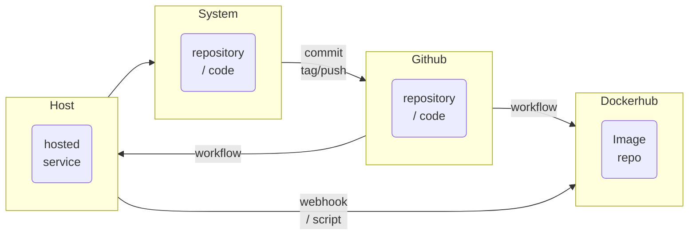

# Part 1

- The goal of this project is to practice using continuous deployment tools and understand the methods to improve deployment workflow. We will be using github workflows, webhooks, dockerhub, and docker to automate deployment.
- The tag function is applied to the last commit with the command `git tag -a v1.2.3 -m "version message"` and then pushed with the command `git push origin v1.2.3`
- A git workflow uses a virtualized setting to run commands that you set up when you push, tag, or potentially pull from github, depending on the criteria you set. My workflow runs when I push a new version and autobuilds my webhost image and tags it with my github versioning, and then sends a notification to my instance so that it will update the running image.
- https://hub.docker.com/repository/docker/rabiddoughnuts/project/general

# Part 2

- You install docker on the instance with the command `sudo apt install docker.io -y`
- The container restart script is used so the container can be replaced by one created with the updated image, and pulls the new image stops the container, removes it, gets rid of the old image, and then starts a new container from the new image. The script is in the `/var/scripts/` folder.
- To set up a webhook on your machine running the container, or an instance dedicated to updating other instances, you use the command `sudo apt-get install webhook` to install adnanh's webhook, make a configuration file and then start it with the command `webhook -hooks hooks.yaml -verbose`.
- The yaml file sets the id of the webhook, what script to run, the pathing for where the config file is and can optionally have pattern matching for the signal and should go in the `/var/webhooks/` directory.
- In order to configure github to message the listener you have to add a second job to your workflow, and then use `joelwmale` webhook action and give it a location to send the message in the format of `http://yourserver:9000/hooks/redeploy-webhook` optimally through a secret so that others can't find that address and ping your listener to repeatedly run its script.
